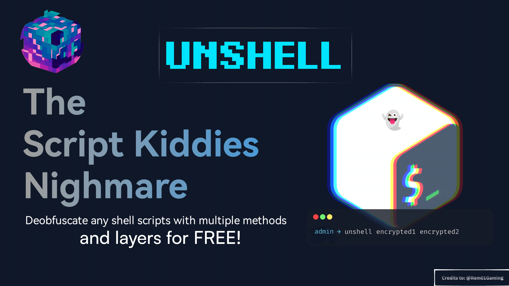

# Unshell
> The Script Kiddies Nightmare 👻

Effortlessly deobfuscate shell scripts back into source code even with heavenly and multi layered obfuscation. unshell will search for patterns on shell script, determine and deobfuscate accordingly.

## Features
- Zero configuration: There's no need for any configuration
- Penetrate: Multi layered obfuscation is not a problem
- Easy to use: just `unshell -f encrypted1.sh encrypted2.sh` in cmd (Terminals like termux, etc)

## Supported Obfuscation Methods
<details>
<summary>Shell Script Compiler (SHC)</summary>
SHC works internally called execve to shell, it decrypted at runtimes and visible via command line args process

eg: <code>/bin/sh -c "decrypted shell"</code>
</details>

<details>
<summary>Simple Script Compiler (SSC)</summary>
It works almost the same as SHC but this one uses C++ and shell reads from file descriptor `3`. It is visible via `fd` number 3 on the process.
</details>

<details>
<summary>Ri-crypt</summary>
Ri-crypt works internally called execve to shell, it decrypted at runtimes and visible via command line args process. We can retrieve the shell script using `strace`.
</details>

<details>
<summary>bash-obfuscate (Node.js CLI)</summary>
bash-obfuscate works by randomizing the script with random variables then executes it in the `eval` command.
</details>

<details>
<summary>BashRock</summary>
Bashrock works almost the same way as bash-obfuscate.
</details>

<details>
<summary>TPP Tool</summary>
The creator of this obfuscation said "it has anti-decode feature" despite multilayered base64 encoding that he uses can easily be decoded.
As of this writing, unshell supports up to version 12 of this "tool".
</details>

<details>
<summary>BashProtector</summary>
Bashrock randomizes the script with random variables layered by single `base64` encryption, then executes it in a single `eval` command.
</details>

<details>
<summary>Extreme comment/editor EOF trick</summary>
Some people obfuscate their script by adding generous amounts of comments until it becomes a really big file, tricking average text editors to crash while opening the script so people can't open it.
</details>

<details>
<summary>BZip2</summary>
Usually used for obfuscating tunneling/VPN scripts. The actual script is compressed with bzip2 and snuck inside the decompression script itself.
</details>

<details>
<summary>Axeron online modules</summary>
The script is actually stored somewhere online (usually public GitHub pages, a script kiddies' behavior), and the module script does only execution of the actual script after being downloaded from the cloud. The file link itself is obfuscated with base64 and rot17.
</details>

<details>
<summary>Base64</summary>
Not too crazy, just classic
```sh
echo "ZWNobyBzb21lIGJhc2U2NCBlbmNyeXB0ZWQgc2hpdAo=" | base64 -d | sh
```
</details>

<details>
<summary>Binary Encoding</summary>
Binary encoding involves converting the script into binary (0s and 1s) format. This is usually done by encoding each character into its binary equivalent, making the script unreadable to the human eye. It can be executed with a simple shell script after conversion.Example:
`
echo "01001000 01100101 01101100 01101100 01101111" | xxd -r -p | sh
`
</details>

<details>
<summary>URL Encoding</summary>
URL encoding replaces special characters with percent-encoded characters. It is often used to obfuscate URLs but can also be used to obscure shell scripts. The encoded string must be decoded back to its original form for execution.Example:
`
echo "echo%20Hello%20World%21" | sed 's/%/\\x/g' | xargs -0 bash -c
`
</details>

<details>
<summary>Reverse Encoding</summary>
Reverse encoding simply reverses the string of the script. It can make the script hard to read but is easily reversible by reversing the string back.Example:
`
echo "dlrow olleh" | rev | sh
`
</details>

<details>
<summary>Octal Encoding</summary>
In octal encoding, each character is represented by its octal ASCII value. It can be used to hide the true nature of a script and may require decoding back into the original string.Example:
`
echo -e "\110\145\154\154\157" | sh
`
</details>

<details>
<summary>Hexadecimal Encoding</summary>
Hexadecimal encoding is a method of representing the shell script characters in hexadecimal format. This can make the script unreadable until it's converted back to its original form.Example:
`
echo "68656c6c6f" | xxd -r -p | sh
`
</details>

<details>
<summary>ROT47 Encoding</summary>
ROT47 is similar to ROT13, but it shifts the ASCII characters by 47 positions. It is used to obscure the text by shifting readable characters.Example:
`
echo "U29tZSB0ZXh0" | tr 'A-Za-z0-9' 'P-ZA-Op-z0-9' | base64 -d
`
</details>

<details>
<summary>ROT18 Encoding</summary>
ROT18 is a variant of ROT13 that applies both ROT13 and ROT5 encoding. It shifts alphabetic characters by 13 positions and numeric characters by 5 positions.Example:
`
echo "12345" | tr '0-9' '5-9A-Ea-e' | tr 'A-Za-z' 'N-ZA-Mn-za-m'
`
</details>

<details>
<summary>ROT57 Encoding</summary>
ROT57 is a more complex variant of ROT47 that shifts letters by 57 positions in the ASCII table, making the script harder to decode.Example:
`
echo "TestMessage" | tr 'A-Za-z0-9' 'C-ZA-B1-9A-B' | base64 -d
`
</details>

<details>
<summary>ROT13 Encoding</summary>
ROT13 shifts the alphabet by 13 positions. It’s often used in forums and newsgroups to obscure spoilers, puzzles, or simple ciphers.Example:
`
echo "Uryyb Jbeyq" | tr 'A-Za-z' 'N-ZA-Mn-za-m' | sh
`
</details>

## Installation
```shell
spath=$(echo $PATH | cut -d: -f1)
curl -sLo $spath/unshell https://github.com/JeremiManaluYT/unshell/raw/main/unshell
chmod +x $spath/unshell
```

## Usage
```yaml
unshell - Deobfuscate any shell scripts with multiple methods
  Usage: unshell [OPTIONS] [FILE]
  Usage: unshell [OPTIONS] [DIR]

  Options:
    -h, --help
      Show this message
    -f, --file [FILE]
      Specify script(s) to deobfuscate (supports multiple inputs)d
    -r, --recursive [DIR]
      Recursively find and deobfuscate shells in the specified directory
    -v, --verbose
      Enable verbose mode (for debugging or troubleshooting
    -d, --execve-delay [SECOND]
      Set a custom execve delay in seconds (for SHC/SSC encryption)
    -U, --update
      Update the script

  Example usages:
    unshell -f install.sh menu.sh
    unshell -v -f /system/bin/gaming_script.sg
    unshell -d 6.018 -f ./VTK
    unshell -r dir
```

## WARNING
Using unshell to retrieve the original shell script from SHC, SSC, or Ri-crypt obfuscation could potentially harm your machine, these obfuscation type requires to executing the script to order to deobfuscate thus leave your machine in danger if script does something malicious. Avoid running unshell with ROOT permissions unless you fully trust the script!

## Special Credits
- [Rem01Gaming](https://github.com/Rem01Gaming/unshell) for the original repository.
- [kawaii-ghost](https://github.com/kawaii-ghost/deshc) for decsh (shc and ssc deobfucator).
- [RiProG-id](https://github.com/RiProG-id/Universal-Shell-Dec.git) for universal-shell-dec, the inspiration and foundation of (https://github.com/Rem01Gaming/unshell) and this project.
